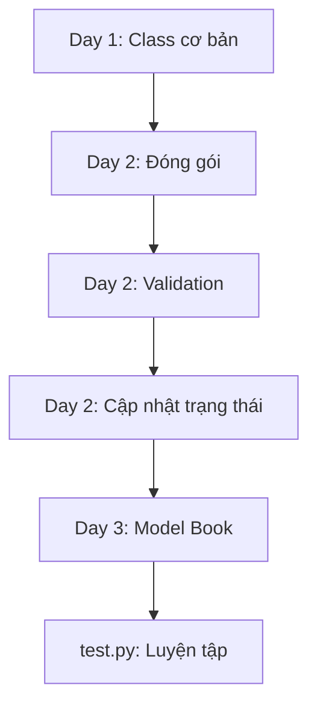

# Tổng quan và Mục tiêu học tập

## Tổng quan

Repository này mô tả một hành trình học lập trình hướng đối tượng (OOP) trong Python theo từng bước. Nội dung tập trung vào:

- Định nghĩa class
- Khởi tạo object
- Đóng gói dữ liệu bằng `property`
- Thực hiện logic nghiệp vụ đơn giản với các model như `Product` và `Book`

Code được phát triển dần từ việc truy cập thuộc tính trực tiếp → sang cách an toàn hơn bằng getter, setter và `@property`.

---

## Lộ trình học tổng thể

### Tiến trình học



### Nội dung từng ngày:

- **Day 1**
  - Học cách tạo class (`Product`)
  - `__init__`
  - Thuộc tính instance
  - Method cơ bản

- **Day 2**
  - Đóng gói với `@property`
  - Validation dữ liệu
  - Method cập nhật trạng thái (`update_stock`)

- **Day 3**
  - Áp dụng lại với class `Book`
  - Kiểm tra dữ liệu (`page_count`)
  - Cập nhật số trang

- **test.py**
  - Luyện tập lại `Book`
  - Thay đổi message lỗi

---

## Model chính

### 1. Product (Day 1 & Day 2)

#### Day 1 – Cơ bản

- Thuộc tính public:
  - `product_id`
  - `name`
  - `price`
  - `stock_quantity`

- Method:
  - `display_info()`

👉 Truy cập trực tiếp:
```python
laptop.price
```

---

#### Day 2 – Đóng gói & Validation

- Sử dụng:
  - `@property`
  - setter

- Validation:
```python
if value < 0:
    raise ValueError("Không hợp lệ")
```

- Thuộc tính private:
```python
self._price
self._stock_quantity
```

- Method mới:
```python
update_stock()
```

👉 Cập nhật:
```python
self.stock_quantity = self.stock_quantity + change
```

---

### 2. Book (Day 3 & test.py)

#### Thuộc tính:

- `book_id`
- `title`
- `author`
- `page_count`

#### Validation:

```python
if not isinstance(value, int) or value <= 0:
    raise ValueError(...)
```

#### Method:

- `display_book_info()`
- `add_pages()`
- `remove_pages()`

---

## Luồng hoạt động

### Product

1. Tạo object
2. Hiển thị thông tin
3. Cập nhật số lượng
4. Validate dữ liệu

---

### Book

1. Tạo sách
2. Thêm trang
3. Giảm trang
4. Hiển thị

---

## Mục tiêu học được

| Nội dung | Ý nghĩa |
|----------|--------|
| Class & `__init__` | Hiểu cách tạo object |
| Method | Gắn hành vi vào object |
| Property | Ẩn dữ liệu |
| Validation | Tránh dữ liệu sai |
| Update state | Thay đổi dữ liệu an toàn |
| Try/except | Xử lý lỗi |

---

## Kết luận

Project này là một lộ trình học OOP Python rất rõ ràng:

- Từ cơ bản → nâng cao dần
- Từ code “thoáng” → code “an toàn”
- Tập trung vào:
  - Đóng gói (Encapsulation)
  - Validation
  - Clean code

`Product` và `Book` là 2 ví dụ giúp bạn hiểu cách thiết kế model trong thực tế.

---
